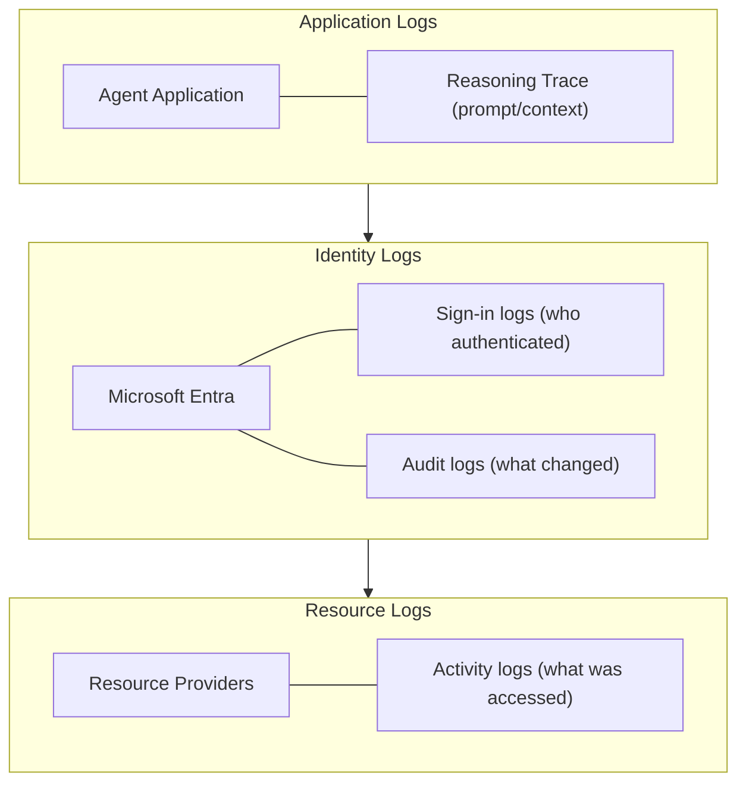

## The Principle

Traditional audit logs answer **what** happened:

- "Agent X accessed file Y at time Z"

Agent auditing must also capture **why**:

- "Agent X accessed file Y because user asked about Q3 revenue"

## Why Reasoning Traces Matter

| Without Trace | With Trace |
|---------------|------------|
| "Agent read 500 emails" | "Agent summarized inbox per user request" |
| "Agent deleted calendar event" | "Agent declined meeting due to conflict policy" |
| "Agent sent email to external" | "Agent replied to customer inquiry about order #1234" |

## Components of Agent Logs

Microsoft Entra Agent ID provides:

1. **Sign-in logs**: Authentication events for agent identities
2. **Audit logs**: Administrative changes (permissions, sponsors)
3. **Activity logs**: Resource access (what was touched)
4. **Reasoning trace**: (Application-level) Why the action occurred

## Log Capture Architecture

## Correlation Challenge

Linking these together requires:

- Consistent correlation IDs across systems
- Agent identity as the joining key
- Timestamp alignment

---

## Links

- [[112-unique-machine-identities]] - Unique IDs enable correlation
- [[140-agent-risk-detection]] - Anomalies need context to investigate
- [[142-automated-kill-switch]] - Logs trigger automated response

## Source

- [Microsoft Entra Agent ID logs](https://learn.microsoft.com/en-us/entra/agent-id/identity-professional/sign-in-audit-logs-agents)
- [What are Microsoft Entra audit logs?](https://learn.microsoft.com/en-us/entra/identity/monitoring-health/concept-audit-logs)
- [What are Microsoft Entra sign-in logs?](https://learn.microsoft.com/en-us/entra/identity/monitoring-health/concept-sign-ins)
